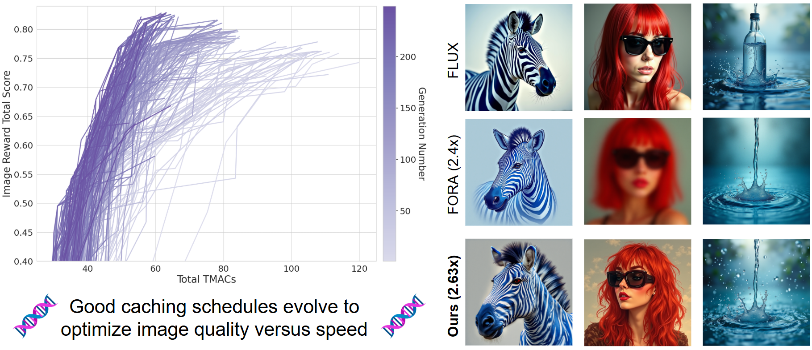

<p align="center">
  
</p>

# Evolutionary Caching to Accelerate Your Off-the-Shelf Diffusion Model

This repository contains the official implementation of ECAD (Evolutionary Caching for Accelerated Diffusion), a method that uses evolutionary algorithms to optimize caching schedules for diffusion models. ECAD automatically discovers optimal layer-wise caching patterns that accelerate inference while maintaining image quality. Our approach works with off-the-shelf diffusion models including PixArt-α, PixArt-Σ, and FLUX, achieving significant speedups without requiring model retraining or architectural modifications.


<div align="center">
<a href="https://aniaggarwal.github.io/ecad/"></a> &ensp;
<a href="https://arxiv.org/abs/2506.15682"></a> &ensp;
</div>

## Requirements

Set up the environment and install all necessary dependencies. Ensure that you are using Python 3.10 or later as specified in `ecad.yml`.

1. **Create a virtual environment**

   ```bash
   conda env create -f ecad.yml
   conda activate ecad
   pip install -r requirements.txt
   pip install -e .
   ```

   The last command installs the `ecad` directory as a package in 'edit' mode. If you run into issues with relative imports, re-run the last command from the git root.

2. **Configure environment variables**:

   Copy the `.env_template` file as follows:

   ```bash
   cp .env_template .env
   ```

   Then modify the `.env` file to match your local setup. Update any paths accordingly. For example:

   ```bash
   # In .env
   PROJECT_ROOT="~/ecad" # SET THIS TO YOUR PROJECT ROOT, i.e. where this file is located, as returned by `git rev-parse --show-toplevel`
   ```

   Replace the example path with the actual location of your project directory on your system.

### Preventing OOM Issues
When running any of the scripts, make sure to have set the below variable; alternatively add this to your shell rc file.
This will prevent OOM issues during image generation.

```bash
export PYTORCH_CUDA_ALLOC_CONF="expandable_segments:True"
```

## ECAD Optimization

ECAD optimization is achieved by running the `train_nsga2_single_gpu.py` script, which implements the NSGA‑II algorithm for single GPU execution. This script runs the optimization process sequentially, executing image generation, scoring, and metrics computation steps one after another.

We **recommend** using `nohup` when running on a remote server to protect against SSH connectivity issues.

Below is an example command to optimize the PixArt-α model at 256×256 resolution. Results (all schedules by generation) will be saved under `results/genetic/pixart_alpha/pixart_alpha_256_random_init` and all benchmark results will be in `results/benchmark/genetic/pixart_alpha/pixart_alpha_256_random_init`:

```bash
nohup python ecad/genetic/train_nsga2_single_gpu.py \
    --image-generator PixArtAlphaImageGenerator \
    --name pixart_alpha_256_random_init \
    --num-cycles 50 \
    --all-populations-dir results/genetic/pixart_alpha \
    --all-benchmarks-dir results/benchmark/genetic/pixart_alpha \
    --batch-size 100 \
    --population-size 72 \
    --embedding-dir /path/to/results/embeddings/image_reward/pixart_alpha_embeddings \
    --benchmark-prompts prompts/ImageRewardPrompts.json \
    &> nohup_pixart_alpha_ecad_optimize.out & disown
```

**Note**: When starting a new optimization run without an existing population, you will be prompted to confirm random initialization.

To **resume** optimization from a previous checkpoint, replace the `--name` flag with:

```bash
--load-from results/genetic/pixart_alpha/pixart_alpha_256_random_init/gen_010/manager_config.json
```

For a full list of options and parameters, simply append the `--help` flag:

```bash
python ecad/genetic/train_nsga2_single_gpu.py --help
```

### Using an Initial Population

To use some custom initial population, instead of random initialization, see the `Initial Population` [ReadMe](assets/docs/initial-population.md).

### ECAD Schedules

For more details on schedules, see the `ECAD Schedules` [ReadMe](assets/docs/ecad-schedules.md).

### Preparing Prompts

To precompute prompt embeddings, see the `Preparing Prompts` [ReadMe](assets/docs/preparing-prompts.md).

## Image Generation

For quick inference without pre-generating embeddings, use the `inference.py` script. This tool allows you to generate images directly from prompts or prompt files, automatically handling embedding generation and image creation in one step. We provide some helpful examples.

Generate images from a single text prompt, using one of our caching schedules:

```bash
python ecad/inference/inference.py \
    PixArtAlphaImageGenerator \
    --schedule schedules/schedules_in_paper/ours_fast.json \
    --prompt "A fremen stands atop a towering sand dune, clad in a stillsuit and gripping a worm hook in each hand, facing the vast, sun-scorched desert." \
    --num-images-per-prompt 5 \
    --output-dir results/inference/single_prompt
```

Generate images for multiple prompts from a text file, without caching:

```bash
python ecad/inference/inference.py \
    PixArtAlphaImageGenerator \
    --prompt-file prompts/my_prompts.txt \
    --num-images-per-prompt 10 \
    --batch-size-generate 4 \
    --output-dir results/inference/batch_prompts
```

For more options and scripts, including how to use your precomputed text embeddings, see the `Image Generation` [ReadMe](assets/docs/image-generation.md)

## Benchmarking

For details on latency (MACs, time) and quality (Image Reward, FID, CLIP Score) metrics, see the `Benchmarking` [ReadMe](assets/docs/benchmarking.md).

## Datasets

For details on setting up and computing metrics for datasets that we use in our paper (COCO and MJHQ), see the `Datasets` [ReadMe](assets/docs/datasets.md).

## Contact

For issues, questions, or contributions:
- **GitHub Issues**: Please open an issue on this [GitHub repository](https://github.com/AniAggarwal/ecad/issues) for bug reports or feature requests
- **Email**: For other inquiries, contact Anirud Aggarwal at anirud@umd.edu

## BibTeX

    @misc{aggarwal2025evolutionarycachingaccelerateofftheshelf,
      title={Evolutionary Caching to Accelerate Your Off-the-Shelf Diffusion Model}, 
      author={Anirud Aggarwal and Abhinav Shrivastava and Matthew Gwilliam},
      year={2025},
      eprint={2506.15682},
      archivePrefix={arXiv},
      primaryClass={cs.CV},
      url={https://arxiv.org/abs/2506.15682}, 
    }